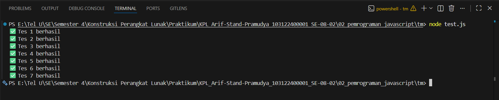

# Tugas Mandiri 02: Pemrograman JavaScript
**Soal**

Buatlah sebuah fungsi bernama fizzBuzz yang menerima input larik (array) dan mengembalikan deretan bilangan dan "Fizz" untuk kelipatan 2, "Buzz" untuk kelipatan 7, dan "FizzBuzz" untuk kelipatan 14. Beri nama berkas program sebagai tm.js dan taruh di direktori TM.

**Kode sumber**

Tersedia di [test.js](test.js) dan [tm.js](tm.js)

**Output**

()

**Deskripsi Program**

Program ini memproses setiap elemen dalam array input dan menentukan apakah elemen tersebut merupakan:
- Kelipatan 14 diganti dengan "FizzBuzz"
- Kelipatan 2 diganti dengan "Fizz"
- Kelipatan 7 diganti dengan "Buzz"

Lalu, program ini juga memvalidasi input:
- Jika input bukan array akan mengembalikan "Input tidak valid"
- Jika ada elemen array yang bukan angka akan mengembalikan "Input tidak valid"

Pendekatan ini memastikan output konsisten dan sesuai dengan aturan FizzBuzz tanpa mengubah angka yang tidak relevan, sekaligus menjaga error handling untuk input yang salah.