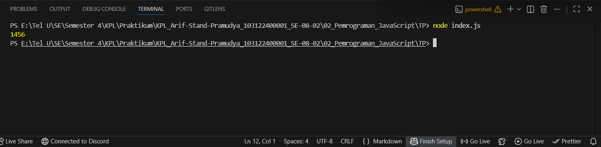

# Tugas Pendahuluan 02: Pemrograman JavaScript
**Nama:** Arif Stand Pramudya

**NIM:** 103122400001

**Kelas:** S1SE-08-02

## Soal

Kamu sudah menulis fungsi mulOfArray. Ujilah dengan input [2, 0, 26, 28, -2], dengan output yang seharusnya adalah 1456. Jika kamu menemukan bahwa hasilnya berbeda, bisakah kamu memperbaikinya? Jika kamu menemukan bahwa hasilnya sama, bisakah kamu menjelaskan mengapa demikian?

## Kode sumber

Tersedia di [index.js](index.js)

## Output

## Deskripsi Program

Program ini menjalankan perkalian semua bilangan positif dalam sebuah array.

Sesuai soal yang diberikan dengan input `[2, 0, 26, 28, -2]` ketika saya run output yang dihasilkan adalah 0. Ada perbedaan hasil sehingga saya perlu memperbaiki codenya.

Disini saya memperbaiki code pada bagian `(arr[i] >= 0)`. Kondisi tersebut menyebabkan angka 0 ikut dikalikan sehingga output menjadi 0, karena dalam operasi perkalian jika terdapat 0 maka seluruh hasil menjadi 0.

Setelah diperbaiki code tersebut menjadi `(arr[i] > 0)`. Hanya bilangan positif yang dikalikan, sehingga hasilnya sesuai dengan yang diharapkan yaitu `1456`.

Atau cara yang sederhananya cukup hilangkan angka 0 pada array, Maka hasil outputnya akan sesuai dengan yang diharapkan.