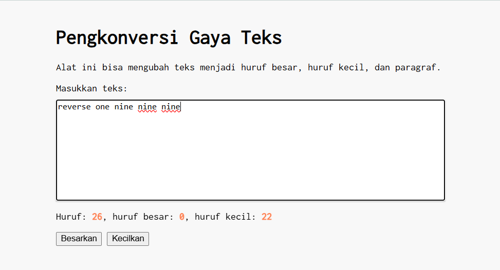
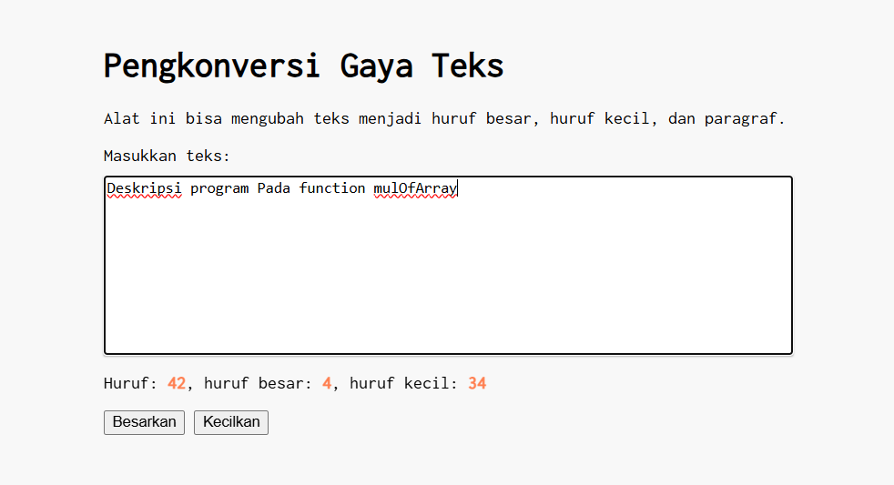
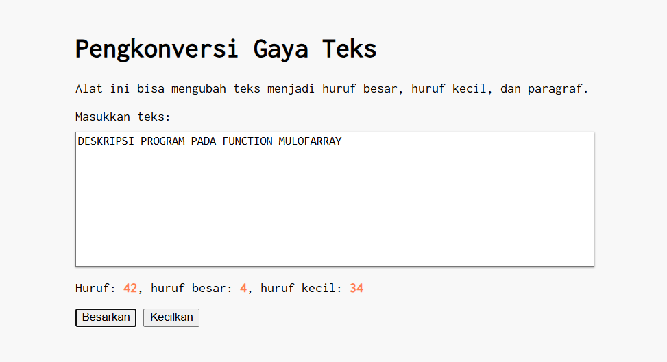
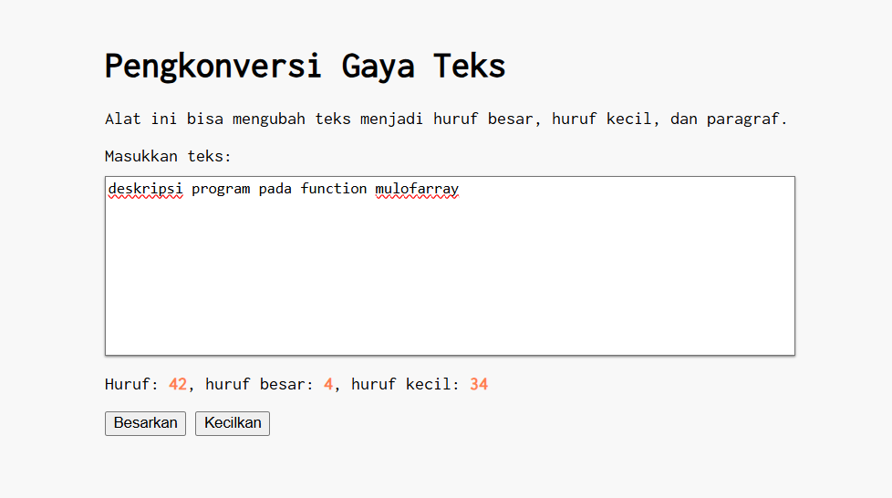

# Tugas Mandiri 03: GUI dengan HTML dan CSS
**Nama:** Arif Stand Pramudya

**NIM:** 103122400001

**Kelas:** S1SE-08-02

## Soal

Setelah kamu menyelesaikan tugas pendahuluan (bisa buka di atas), terapkanlah fungsi untuk (1) menghitung huruf kecil yang disediakan di #hk, (2) mengubah huruf kecil ke huruf besar ketika pengguna menekan tombol `#huruf-besar`, dan (3) mengubah huruf besar ke huruf kecil ketika pengguna menekan tombol `#huruf-kecil`.

Untuk nomor 2 dan 3, tampilkan hasilnya di dalam `editor-kecil`.

Kemudian, hapuslah fitur "Paragrafkan" dari alat.

## Kode sumber

Tersedia di [index.html](index.html), [index.css](index.css), dan [index.js](index.js)

## Output

* Contoh uji kasus untuk hitung huruf kecil:






* Contoh uji kasus untuk "Besarkan" huruf:



* Contoh uji kasus untuk "Kecilkan" huruf:



## Deskripsi Program

Pada Tugas Mandiri ini saya sudah menghapus elemen button pada file "index.html" dan "index.js". Sehingga program ini hanya menampilkan dua button yaitu `Besarkan` dan `Kecilkan`.

Selanjutnya, saya menambahkan code pada file "index.js" untuk membaca teks dari textarea, menghitung jumlah huruf, dan mengubah bentuk huruf ketika tombol ditekan. Berikut untuk penjelasan bagian code:

```
const editorElement = document.getElementById("editor-kecil");
const charCountElement = document.getElementById("hf");

const capsCountElement = document.getElementById("hb");
const lowerCountElement = document.getElementById("hk");
```
Bagian code ini berfungsi untuk mengambil elemen HTML yang akan digunakan.

```
editorElement.addEventListener("input", (event) => {
```
Event `input` akan berjalan setiap kali mengetik atau mengubah teks di textarea.

```
charCountElement.textContent = text.length;
```
Menghitung total karakter dalam teks menggunakan `length`.

```
text.match(/[A-Z]/g)
text.match(/[a-z]/g)
```
Code ini berfungsi untuk mencari huruf besar dan huruf kecil dalam teks, lalu menghitung jumlahnya.

```
editorElement.value.toUpperCase()
editorElement.value.toLowerCase()
```
Button `huruf-besar` untuk mengubah semua teks menjadi huruf besar, dan button `huruf-kecil` mengubah semua teks menjadi huruf kecil.