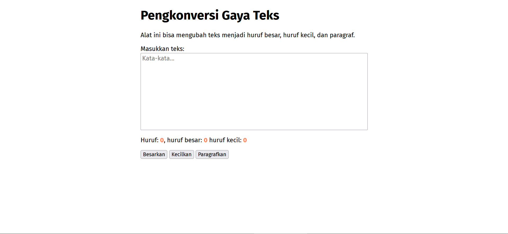
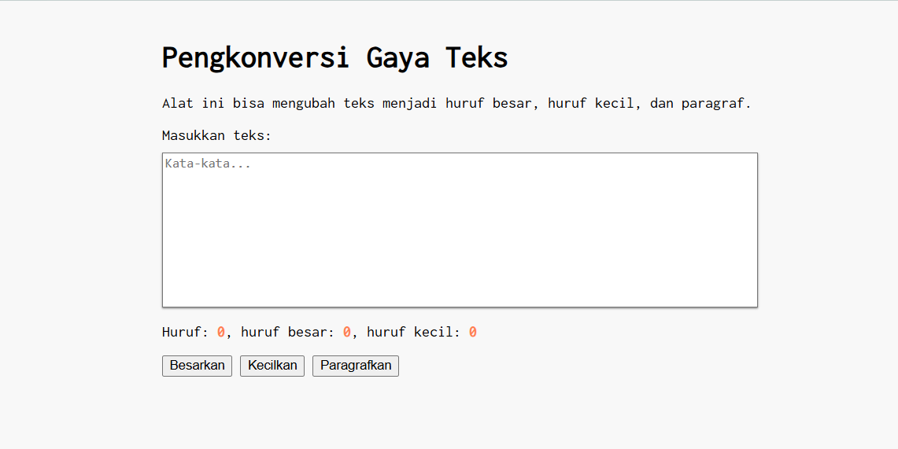

# Tugas Pendahuluan 03: GUI dengan HTML dan CSS
**Nama:** Arif Stand Pramudya

**NIM:** 103122400001

**Kelas:** S1SE-08-02

## Soal

Buatlah tata letak laman yang kamu buat berada di tengah seperti di bawah ini, dan juga ubah font-nya dengan Inconsolata dari Google Fonts.

## Kode sumber

Tersedia di [index.html](index.html), [index.css](index.css), dan [index.js](index.js)

## Output

## Deskripsi Program

Program ini adalah alat konversi gaya teks yang berbasis web dengan HTML, CSS, dan JavaScript. 

Program ini berfungsi untuk melakukan konversi teks yang dimasukkan ke dalam tiga gaya yaitu huruf besar, huruf kecil, dan format paragraf.

Pada Tugas Pendahuluan ini program sudah di ubah tata letaknya menjadi berada di tengah menggunakan `centering layout` pada bagian body dan mengubah font menjadi font `Inconsolata` dari Google Fonts.