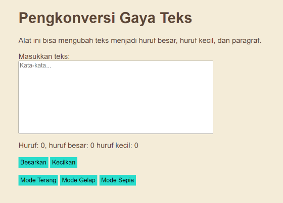
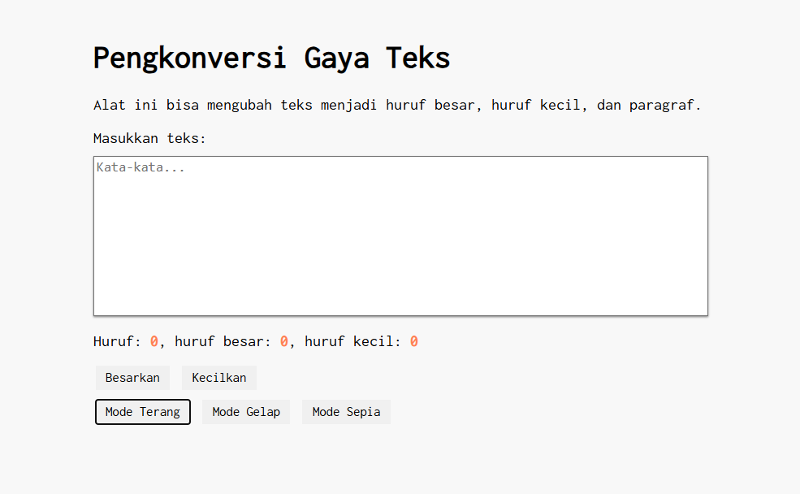
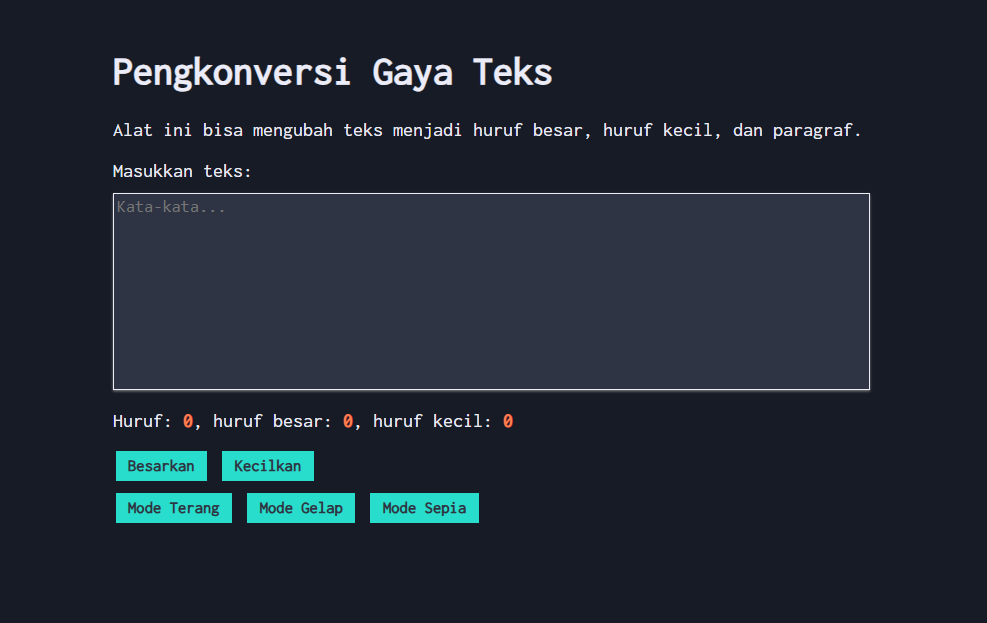
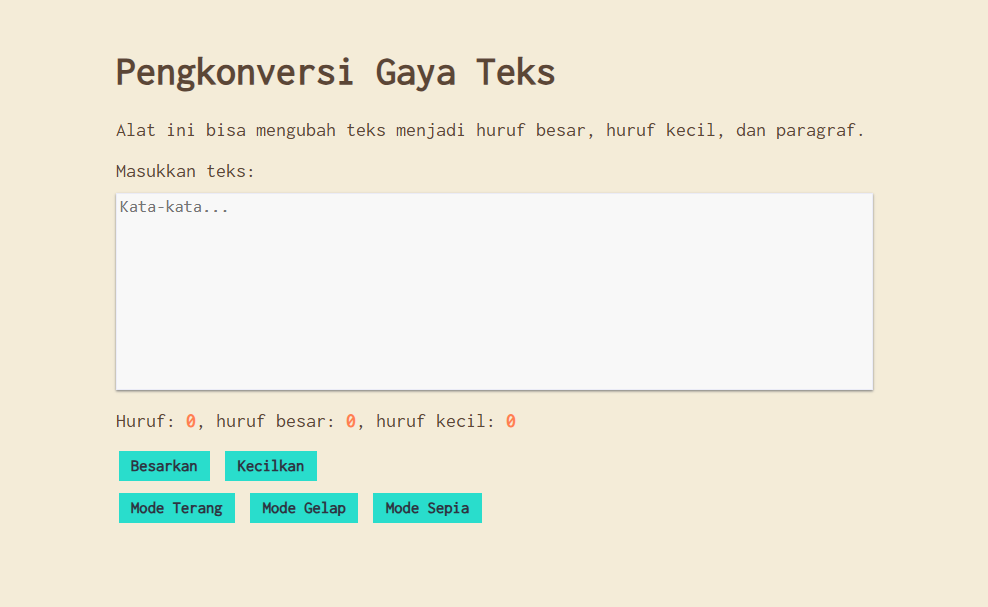

# Tugas Mandiri 04: Automata dan Table-Driven Construction
**Nama:** Arif Stand Pramudya

**NIM:** 103122400001

**Kelas:** S1SE-08-02

## Soal

Tambahkan mode sepia dengan ketentuan:

| **Elemen**     | **Warna** |
|----------------|-----------|
| Latar belakang | #F4ECD8 |
| Warna teks     | #5B4636 |

Biarkan form tetap warna putih.


Contoh Tampilan

Ketentuan lainnya:

1. Bagian `mode-div` harus menaungi tiga button: `light`, `dark`, dan `sepia`
2. Bisa berpindah state secara mulus: `sepia` menghasilkan `sepia-mode`, `dark` menghasilkan `dark-mode`, dan `light` menghasilkan `light-mode`

## Kode sumber

Tersedia di [index.html](index.html), [index.css](index.css), dan [index.js](index.js)

## Output

* **Mode Terang:**



* **Mode Gelap:**



* **Mode Sepia:**



## Deskripsi Program

Pada tugas mandiri modul 4 ini, saya menambahkan mode sepia, yang sebelumnya hanya memiiliki mode terang dan mode gelap.

Ketika menekan tombol `Mode Sepia` halaman dan tombol akan berubah menjadi tampilan sepia dengan latar belakang warna  `#F4ECD8` dan teks yang berwarna `#5B4636`. Untuk kotak editor tetap berwarna `putih`.

Pada tugas ini saya menambahkan beberapa baris kode, berikut penjelasannya:

```
<div class="mode-div">
        <button id="tombol-terang">Mode Terang</button>
        <button id="tombol-gelap">Mode Gelap</button>
        <button id="tombol-sepia">Mode Sepia</button>
    </div>
```
Pada [index.html](index.html), saya menambahkan satu tombol yang berfungsi untuk mengubah tampilan menjadi mode sepia.

```
.mode-sepia body {
    background-color: #f4ecd8;
    color: #5b4636;
}

.mode-sepia .container {
    background-color: #f4ecd8;
}

.mode-sepia .kotak-input {
    background-color: #f8f8f8;
    color: #5b4636;
    border: 1px solid #ebecf7;
}

.mode-sepia button {
    background-color: #29ddcc;
    color: #2e3443;
    font-weight: bold;
    border: none;
}
```
Pada  [index.css](index.css), kelas `.mode-sepia` digunakan untuk mengubah tampilan halaman, editor teks, dan tombol menjadi sepia. Lalu kode `border: none;` untuk menghapus pinggiran tombol.

```
buttonLightElement.addEventListener("click", () => {
    document.documentElement.classList.remove("mode-gelap");
    document.documentElement.classList.remove("mode-sepia");
});

buttonDarkElement.addEventListener("click", () => {
    document.documentElement.classList.remove("mode-sepia");
    document.documentElement.classList.add("mode-gelap");
});

buttonSepiaElement.addEventListener("click", () => {
    document.documentElement.classList.remove("mode-gelap");
    document.documentElement.classList.add("mode-sepia");
});
```
Pada [index.js](index.js), saya melakukan sedikit penambahan baris kode untuk mengatur perubahan warna mode menggunakan `event listener` pada tombol.