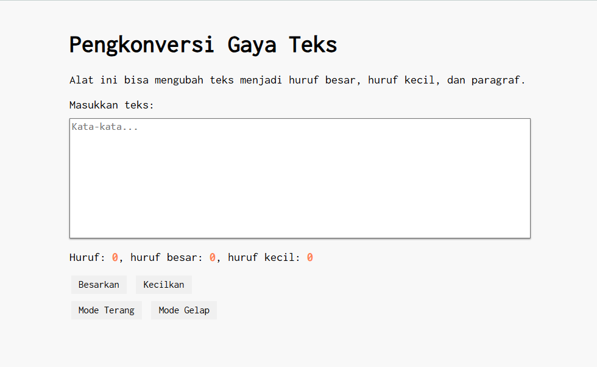
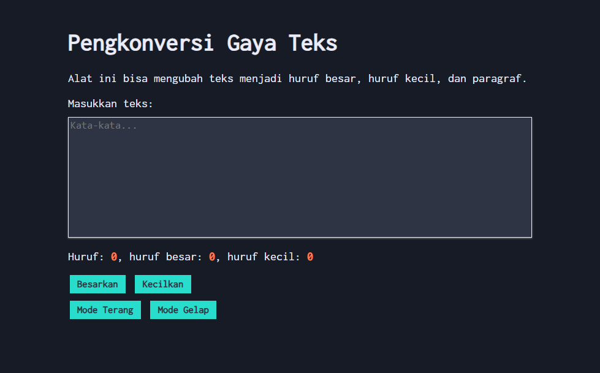

# Tugas Pendahuluan 04: Automata dan Table-Driven Construction
**Nama:** Arif Stand Pramudya

**NIM:** 103122400001

**Kelas:** S1SE-08-02

## Soal

Tambahkan mode gelap sekaligus untuk `editor-kecil` dan tombol-tombolnya. Ketentuan warna untuk latar belakang editor-kecil adalah #2e3443, sementara untuk tombol adalah #29ddcc. Teks untuk tombol tetap mengikuti warna teks sebelumnya.

Untuk menghapus pinggiran tombol, nyatakan properti `border` untuk tidak ditunjukkan.

## Kode sumber

Tersedia di [index.html](index.html), [index.css](index.css), dan [index.js](index.js)

## Output

* Mode Terang:



* Mode Gelap:



## Deskripsi Program

Pada tugas pendahuluan modul 4 ini, saya menambahkan fitur mode terang dan mode gelap yang memungkinkan mengganti tampilan halaman. 

Ketika menekan tombol `Mode Gelap` halaman, kotak editor, dan tombol akan berubah menjadi tampilan gelap dengan latar belakang yang lebih gelap dan warna teks yang lebih terang. Sebaliknya, ketika tombol `Mode Terang` ditekan, tampilan akan kembali normal.

Pada tugas ini saya menambahkan beberapa baris kode, berikut penjelasannya:

```
<button id="tombol-terang">Mode Terang</button>
<button id="tombol-gelap">Mode Gelap</button>
```
Pada [index.html](index.html), dua tombol ini digunakan untuk mengubah tampilan halaman antara mode terang dan mode gelap.

```
.mode-gelap body {
    background-color: #171b25;
    color: #ebecf7;
}

.mode-gelap .kotak-input {
    background-color: #2e3443;
    color: #ebecf7;
    border: 1px solid #ebecf7;
}

.mode-gelap button {
    background-color: #29ddcc;
    color: #2e3443;
    font-weight: bold;
    border: none;
}

.mode-gelap .container {
    background-color: #171b25;
}
```
Pada  [index.css](index.css) kelas `.mode-gelap` digunakan untuk mengubah tampilan halaman, editor teks, dan tombol menjadi gelap. Lalu kode `border: none;` ini untuk menghapus pinggiran tombol.

```
buttonLightElement.addEventListener("click", () => {
    document.documentElement.classList.remove("mode-gelap");
});
```
Pada [index.js](index.js), kode ini dijalankan ketika tombol mode terang ditekan. Fungsinya untuk menghapus kelas `mode-gelap` sehingga tampilan kembali ke mode terang.

```
buttonDarkElement.addEventListener("click", () => {
    document.documentElement.classList.add("mode-gelap");
});
```
Kode ini menambahkan kelas `mode-gelap` pada elemen utama [index.html](index.html), sehingga seluruh gaya CSS untuk mode gelap akan aktif.