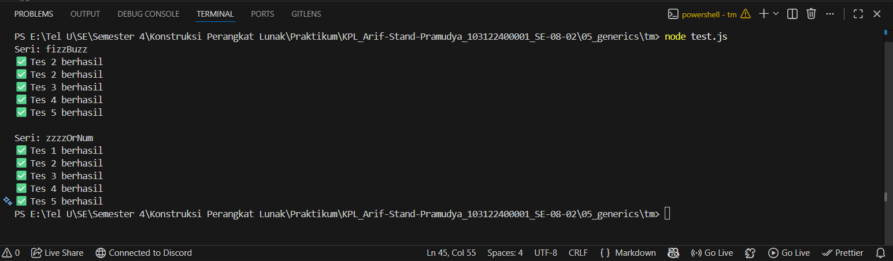

# Tugas Mandiri 05: Generics
**Nama:** Arif Stand Pramudya

**NIM:** 103122400001

**Kelas:** S1SE-08-02

## Soal

Diberikan program `index.js` seperti ini:

```
// Tambah JSDoc di sini
function zzzzOrNum(value) {
    // Ubah kode di sini
}

// Tambah JSDOC di sini
function fizzBuzz(sequence) {
    // Ubah kode di sini

    const newSequence = sequence.map((e) => zzzzOrNum(e));

    return newSequence;
}

module.exports = {
    fizzBuzz: fizzBuzz,
    zzzzOrNum: zzzzOrNum,
};
```

Aturan FizzBuzz kali ini adalah:

1. Fungsi `fizzBuzz` hanya menerima larik yang semua elemennya terdiri dari bilangan bulat dan mengeluarkan larik pula yang bisa jadi bercampur string dan bilangan
2. Fungsi `zzzzOrNum` hanya menerima sebuah data tunggal berupa bilangan bulat dan mengembalikan "Fizz", "FizzBuzz", "Buzz", atau bilanga bulat sesuai logikanya
3. Kedua fungsi harus ada dan harus disertai JSDoc sesuai tipe data yang disiratkan dari no. 1, no. 2, dan perilaku yang diharapkan di bawah
4. `fizzBuzz` harus menggunakan fungsi `zzzzOrNum` di dalamnya

Gunakan konfigurasi ini untuk `tsconfig.json` dan test.js ini untuk menguji kode yang kamu buat.


## Kode sumber

Tersedia di [index.js](index.js) dan [test.js](test.js)

## Output



## Deskripsi Program

Pada tugas mandiri di modul 5 ini, saya menambahkan beberapa baris kode pada program `index.js` yang berisi dua fungsi utama. 

Fungsi yang pertama adalah `zzzzOrNum(value)` untuk memeriksa satu bilangan bulat. Jika habis dibagi 3 maka hasilnya akan `"Fizz"`. Jika habis dibagi 5 maka hasilnya akan `"Buzz"`. Jika habis dibagi 3 dan 5 maka hasilnya akan `"FizzBuzz"`. Jika tidak memenuhi ketiganya, fungsi akan mengembalikan angka aslinya. 

```
/**
 * @param {number} value Bilangan bulat
 * @returns {number | "Fizz" | "Buzz" | "FizzBuzz"}
 */
function zzzzOrNum(value) {
    if (!Number.isInteger(value)) {
        throw new Error("Input harus berupa bilangan bulat.");
    }
    if (value % 15 === 0) {
        return "FizzBuzz";
    }
    if (value % 3 === 0) {
        return "Fizz";
    }
    if (value % 5 === 0) {
        return "Buzz";
    }
    return value;
}
```

Lalu fungsi yang kedua adalah `fizzBuzz(sequence)` yang menerima array berisi bilangan bulat. Setiap elemen array diproses dengan fungsi `zzzzOrNum`, lalu hasil akhirnya dikembalikan sebagai array baru.

```
/**
 * @param {number[]} sequence Larik yang seluruh elemennya bilangan bulat
 * @returns {(number | "Fizz" | "Buzz" | "FizzBuzz")[]}
 */
function fizzBuzz(sequence) {
    if (!Array.isArray(sequence)) {
        throw new Error("Input harus berupa array.");
    }
    if (!sequence.every(Number.isInteger)) {
        throw new Error("Semua elemen array harus berupa bilangan bulat.");
    }
    const newSequence = sequence.map((e) => zzzzOrNum(e));

    return newSequence;
}
```

Dan yang terakhir, kedua fungsi diekspor agar bisa diuji dengan `test.js.`

```
module.exports = {
    fizzBuzz: fizzBuzz,
    zzzzOrNum: zzzzOrNum,
};
```