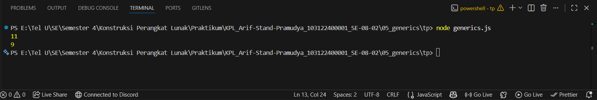

# Tugas Pendahuluan 05: Generics
**Nama:** Arif Stand Pramudya

**NIM:** 103122400001

**Kelas:** S1SE-08-02

## Soal

Ini adalah kode yang mengurus jumlah semua karakter dan jumlah huruf:

```
const str = "Bar bar";

let jumlahSemua = 0;
for (const c of str) { 
    jumlahSemua++; 
}
console.log(total);

let jumlahHuruf = 0;
for (const c of str) { 
    if (c === ' ') continue;
    jumlahHuruf++;
}
console.log(letters);
```

Bagaimana caramu hanya dengan satu fungsi generik bisa mengurus keduanya?

Agar fungsi yang kamu kerjakan benar atau tidak, berikut ini adalah kode tes yang bisa kamu tempelkan:

```
const str = "Bar bar bar";
...
console.log(
   hitung(str, "semua") // Harusnya 11
);

console.log(
  hitung(str, "huruf") // Harusnya 9
);

hitung(str, "huruf"); // Tidak terjadi apa-apa
```

## Kode sumber

Tersedia di [generics.js](generics.js)

## Output



## Deskripsi Program

Pada tugas pendahuluan di modul 5 ini, saya membuat satu fungsi generik yang bisa mengurus kedua hal sesuai dengan soal. Saya membuat fungsi hitung yang menerima dua parameter. Berikut untuk penjelasannya:
1. Yang pertama adalah `str` untuk string yang ingin dihitung dan yang kedua adalah `tipe` untuk menentukan apakah yang dihitung adalah jumlah semua karakter atau hanya huruf tanpa ada spasi.
2. Pada loop, jika `tipe "semua"`, maka setiap karakter dihitung termasuk spasi. Jika `tipe "huruf"`, maka spasi akan diabaikan dan hanya karakter selain spasi yang dihitung.
3. Fungsi `hitung` mengembalikan hasil jumlah berdasarkan tipe yang diminta.

