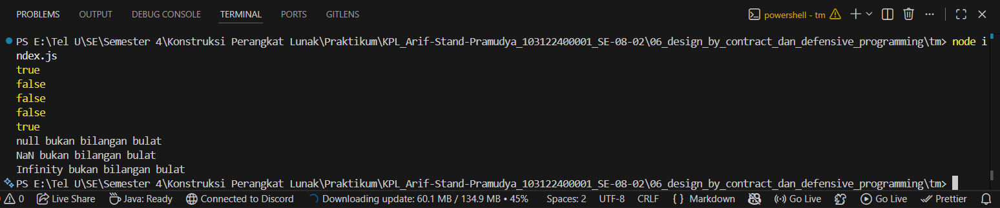

# Tugas Mandiri 06: Design by Contract dan Defensive Programming
**Nama:** Arif Stand Pramudya

**NIM:** 103122400001

**Kelas:** S1SE-08-02

## Soal

Lindungi kode ini dari bilangan-bilangan "fizz buzz"!

Tugasmu adalah membuat fungsi yang menolak bilangan-bilangan kelipatan 3, 5, atau 15, menerima bilangan-bilangan bukan "fizz buzz", dan melempar yang bukan bilangan bulat.

```
function is_not_fizzbuzz(number) {
  // TODO
}

console.log(is_not_fizzbuzz(1)) // true
console.log(is_not_fizzbuzz(3)) // false
console.log(is_not_fizzbuzz(5)) // false
console.log(is_not_fizzbuzz(30)) // false
console.log(is_not_fizzbuzz(7)) // true
console.log(is_not_fizzbuzz(null)) // Lempar TypeError
console.log(is_not_fizzbuzz(NaN)) // Lempar TypeError
console.log(is_not_fizzbuzz(Infinity)) // Lempar TypeError
```

## Kode sumber

Tersedia di [index.js](index.js)

## Output



## Deskripsi Program

Pada tugas mandiri modul 6, saya menambahkan fungsi yang berisi `is_not_fizzbuzz`, yang berfungsi sebagai pelindung terhadap bilangan bilangan FizzBuzz. Fungsi ini mengembalikan `true` jika bilangan bukan dari kelipatan 3,5, dan 15. Dan akan `false` jika termasuk bilangan FizzBuzz. Selanjutnya fungsi akan melempar `TypeError` apabila input bukan bilangan bulat valid seperti `null`, `NaN`, atau `Infinity`.