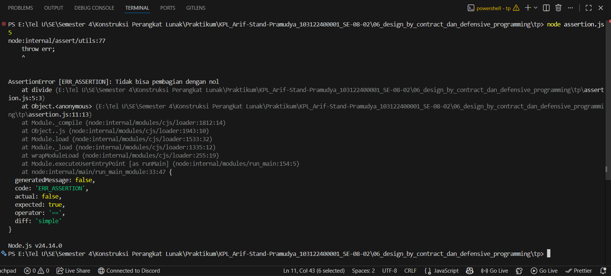
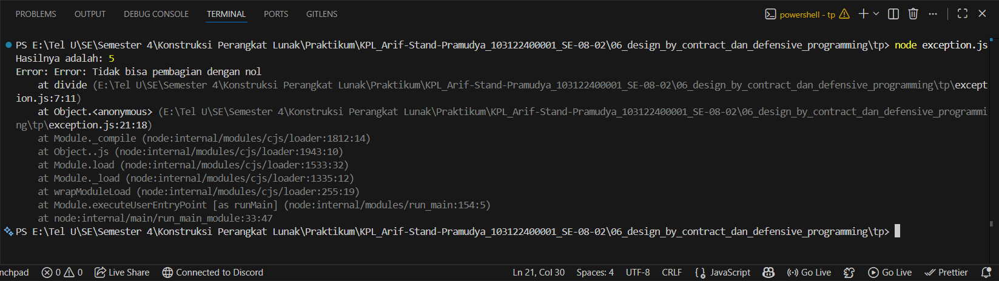

# Tugas Pendahuluan 06: Design by Contract dan Defensive Programming
**Nama:** Arif Stand Pramudya

**NIM:** 103122400001

**Kelas:** S1SE-08-02

## Soal

Diberikan dua kode yang sama-sama melakukan operasi pembagian. Pertama menggunakan asersi, kedua menggunakan eksepsi.

```
const assert = require('assert');

function divide(a, b) {
  assert(typeof a === 'number' && typeof b === 'number', 'Nilai harus bilangan bulat');

  assert(b !== 0, 'Tidak bisa pembagian dengan nol');

  return a / b;
}

```

```
function divide(a, b) {
  if (typeof a !== "number" || typeof b !== "number") {
    throw new TypeError("Nilai harus bilangan bulat");
  }

  if (b === 0) {
    throw new Error("Tidak bisa pembagian dengan nol");
  }

  return a / b;
}

try {
  const result = divide(10, 2);
  console.log("Hasilnya adalah:", result);
} catch (error) {
  console.error("Error:", error);
}
```

Menurutmu, kapankah kita saatnya menggunakan asersi atau eksepsi untuk fungsi seperti ini di atas? Apakah kita harus sepenuhnya asersi, atau sepenuhnya eksepsi? Lakukan riset dan berikan jawabannya dalam bentuk esai minimal 300 kata.

## Kode sumber

Tersedia di [assertion.js](assertion.js) dan [exception.js](exception.js)

## Output

- Assertion


- Exception


## Deskripsi Program

Menurut pendapat saya, baik asersi maupun eksepsi itu memiliki kesamaan untuk menunjukkan kondisi yang tidak diinginkan. Namun, keduanya memmiliki tujuan dan konteks penggunaan yang berbeda. Ketika membuat fungsi seperti `divide(a, b)`, pilihan untuk ingin menerapkan yang mana tergantung pada kapan kesalahan itu akan muncul, bagaimana kemungkinannya, dan respon apa yang diinginkan.

Asersi digunakan untuk mengecek asumsi internal pada kode yang seharusnya tidak pernah salah jika kode berjalan normal. Bukan untuk menangani inputan dari user, tetapi untuk memastikan bahwa kondisi yang di anggap pasti akan terbukti selama runtime. Jika asersi gagal, biasanya ada bug pada kode atau sesuatu yang seharusnya tidak terjadi. Pada `divide(a, b)` misalnya, asersi akan dipakai jika kita yakin semua panggilan fungsi pasti memberikan angka, jika tidak berarti bukan salah input, melainkan salah di logika yang memanggil fungsinya.

Sementara eksepsi digunakan untuk menangani situasi runtime yang mungkin dapat terjadi, termasuk input tidak valid dari user maupun dari luar. Eksepsi memberikan kita kendali penuh untuk bisa menangkapnya menggunakan try dan catch, menunjukkan pesan yang ramah untuk dibaca oleh user, atau melakukan fallback logic. Pada fungsi umum seperti `divide(), input b === 0`, atau inputnya bukan angka, itu adalah hal nyata yang bisa saja datang dari user. Hal tersebut bukan bug dalam kode, tetapi kesalahan input yang harus ditangani.

Karena itu, fungsi publik seperti divide tidak sebaiknya menggunakan asersi untuk validasi input, karena artinya kita tidak siap menghadapi kesalahan dari luar. Input bukan angka atau bagi nol itu di luar kendali fungsi, dan pemanggilnya harus diberitahu memiliki masalah. Eksepsi memberikan peluang untuk pemanggil menangani hal tersebut dengan benar.

Kesimpulannya, untuk fungsi seperti `divide(a, b)`, penggunaan eksepsi lebih tepat daripada asersi jika tujuannya untuk menangani input tidak valid. Eksepsi dapat memberikan informasi kesalahan ke pemanggil dan membiarkan mereka mengambil langkah selanjutnya. Jika asersi lebih cocok untuk mengecek hal internal saat development atau debugging, bukan untuk merespon input dari luar.