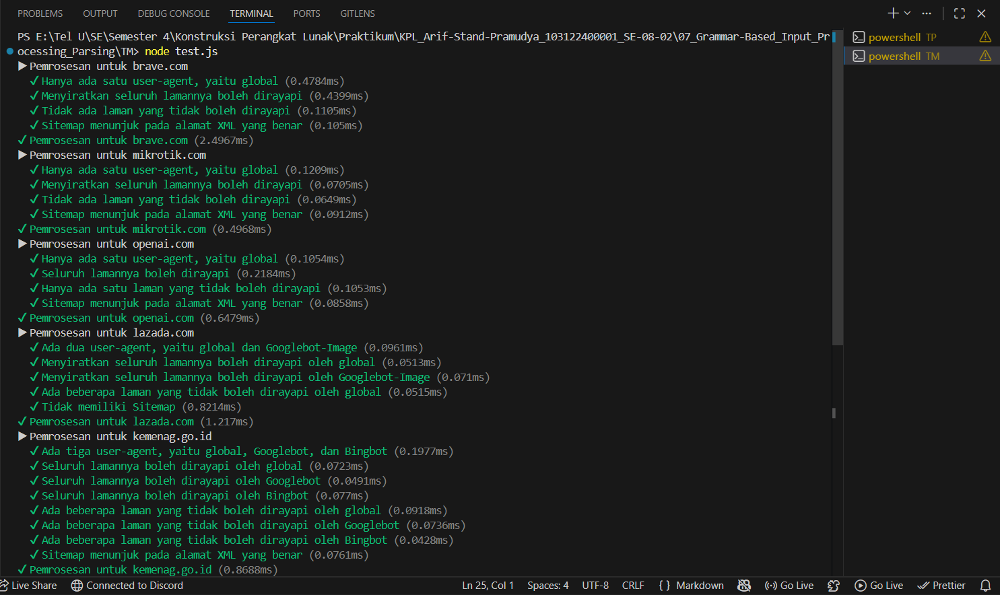
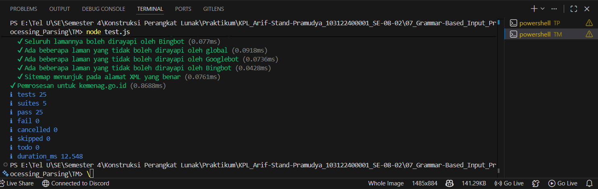

# Tugas Mandiri 07: Grammar-based Input Processing
**Nama:** Arif Stand Pramudya

**NIM:** 103122400001

**Kelas:** S1SE-08-02

## Soal

Tugas pada kesempatan kali ini adalah membuat fungsi yang menguraikan isi robots.txt menjadi POJO (plain old JavaScript object). Empat properti yang perlu diuraikan dijabarkan di bawah berikut.

1. User-agent adalah nama robot perayapnya
2. Allow adalah daftar halaman-halaman yang boleh dirayap
3. Disallow adalah daftar halaman-halaman yang tidak boleh dirayap
4. Sitemap adalah sebuah pranala yang menunjuk pada "denah" situs web (biasanya berformat XML)

Kamu akan mengerjakannya di dalam sebuah fungsi bernama parseRobots di index.js dan. Buka direktori 07 di sini untuk mengunduh berkas yang dimaksud, berkas-berikas robots.txt di dalam direktori daftar, dan berkas pengujiannya yaitu test.js.

## Kode sumber

Tersedia di [index.js](index.js) dan [test.js](test.js)

## Output

## Deskripsi Program

Pada modul 7 tugas mandiri ini, saya mengimplementasikan fungsi `parseRobots` yang berfungsi untuk menguraikan teks dari berkas `robots.txt` menjadi sebuah objek JavaScript terstruktur.

Fungsi akan bekerja dengan membaca teks baris per baris. Setiap baris yang kosong atau diawali tanda `#` akan melewati proses penguraian sekaligus mereset daftar agen aktif. Untuk baris yang valid, teks akan dipecah berdasarkan karakter titik dua untuk memisahkan `key` dan `value`. Terdapat empat key, yaitu:

1. `User-agent` untuk mendaftarkan nama agen ke dalam objek agents.
2. `Allow` untuk menyimpan path yang diizinkan ke dalam array allow milik setiap agen aktif, selama nilainya tidak kosong.
3. `Disallow` untuk menyimpan jalur yang dilarang ke dalam array disallow milik setiap agen aktif, selama nilainya tidak kosong.
4. `Sitemap` untuk menambahkan URL sitemap ke dalam array sitemap pada objek hasil.

Kemudian fungsi akan mengembalikan objek bertipe RobotsTxt sesuai definisi tipe di `structure.d.ts.`