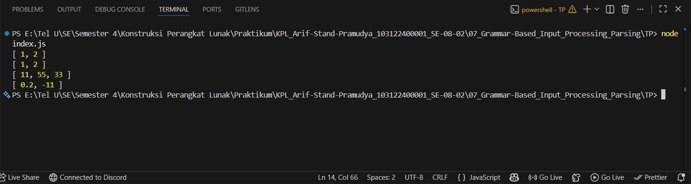

# Tugas Pendahuluan 07: Grammar-based Input Processing
**Nama:** Arif Stand Pramudya

**NIM:** 103122400001

**Kelas:** S1SE-08-02

## Soal

Buatlah fungsi yang mengubah deretan angka bertipe string menjadi larik angka.

```
function toNumberArray(number) {
  // TODO
}

console.log(toNumberArray("1, 2")) // [1, 2]
console.log(toNumberArray(["1", "2"])) // [1, 2]
console.log(toNumberArray(" 11,55,33   ")) // [11, 55, 33]
console.log(toNumberArray(["0.2", "-11", "abc23"])) // [0.2, -11]
```

## Kode sumber

Tersedia di [index.js](index.js)

## Output



## Deskripsi Program

Pada modul 7 tugas pendahuluan ini, saya menambahkan fungsi `toNumberArray()` yang dapat mengubah deretan angka bertipe string menjadi array of number. Pada fungsi ini menangani dua jenis input string dengan pemisah koma maupun array of string, sekaligus memfilter otomatis elemen yang tidak dapat dikonversi menjadi angka valid seperti `"abc23"`.