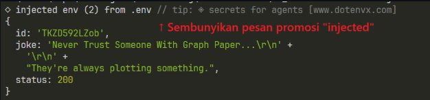
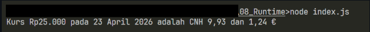
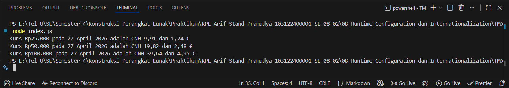

# Tugas Mandiri 08: Runtime Configuration dan Internationalization
**Nama:** Arif Stand Pramudya

**NIM:** 103122400001

**Kelas:** S1SE-08-02

## Soal

Waktunya menukar uang!

Pada tugas ini kamu akan membuat program yang menampilkan kurs rupiah (IDR) terhadap renminbi luar Tiongkok (CNH) dan euro (EUR). Gunakan `link API` ini untuk mengambil data.

Tantangan

1. Simpanlah URL API ke dalam .env sebagai BASE_API

2. Gunakan Intl untuk memformat nilai mata uang dan waktu kamu mengambil data kurs.

3. Hapus pesan promosi dotenv

Lalu pastikan outputnya tampak seperti di bawah ini.

Ujilah dengan Rp25000, Rp50000, dan Rp100000.

## Kode sumber

Tersedia di [index.js](index.js) [.env](.env)

## Output

## Deskripsi Program

Pada modul 8 tugas mandiri ini, saya membuat program yang digunakan untuk mengambil data kurs mata uang dari API yang disimpan pada file `.env`. Program ini membaca nilai kurs CNH dan EUR terhadap IDR, lalu menghitung konversi dari beberapa nominal rupiah, yaitu Rp25.000, Rp50.000, dan Rp100.000. Hasil konversi akan ditampilkan dengan format tanggal dan angka sesuai format Indonesia. 

Disini saya menggunakan `Intl.NumberFormat("id-ID")` untuk mengubah format angka agar mengikuti aturan penulisan angka dalam bahasa Indonesia. Selanjutnya saya menggunakan `require("dotenv").config({ quiet: true });` untuk menghapus pesan promosi dotenv.