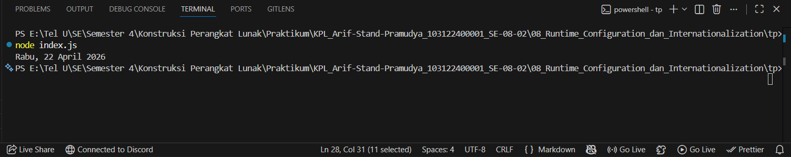

# Tugas Pendahuluan 08: Runtime Configuration dan Internationalization
**Nama:** Arif Stand Pramudya

**NIM:** 103122400001

**Kelas:** S1SE-08-02

## Soal

Tampilkan tanggal sekarang dengan format seperti ini:

```
Sabtu, 18 April 2026
```

Nilai waktu tidak harus sama, asalkan formatnya benar dan bisa tampil di komputer terpisah pada waktu tertentu. Gunakan `Intl.DateTimeFormat` (bukan string manual).

## Kode sumber

Tersedia di [index.js](index.js)

## Output



## Deskripsi Program

Pada modul 8 tugas pendahuluan ini, saya membuat program yang digunakan untuk menampilkan tanggal saat ini dalam format lokal yang sesuai dengan bahasa Indonesia. Menggunakan objek `Intl.DateTimeFormat`, program memformat tanggal dengan menyertakan nama hari, tanggal, bulan, dan tahun. Hasil output akan menampilkan tanggal dalam format seperti `"Senin, 21 April 2026"`, yang disesuaikan dengan format lokal.