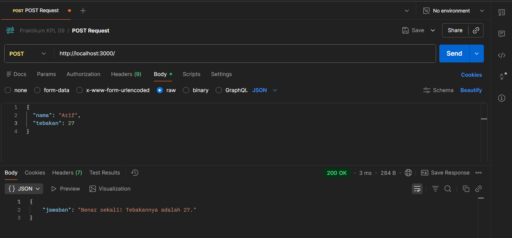
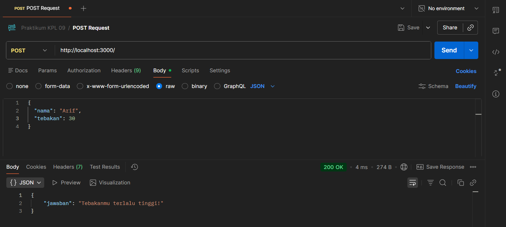
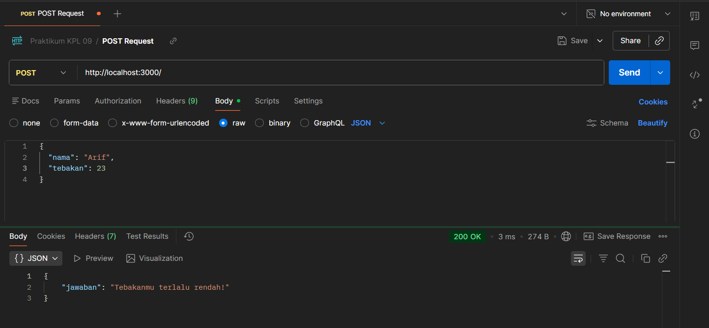
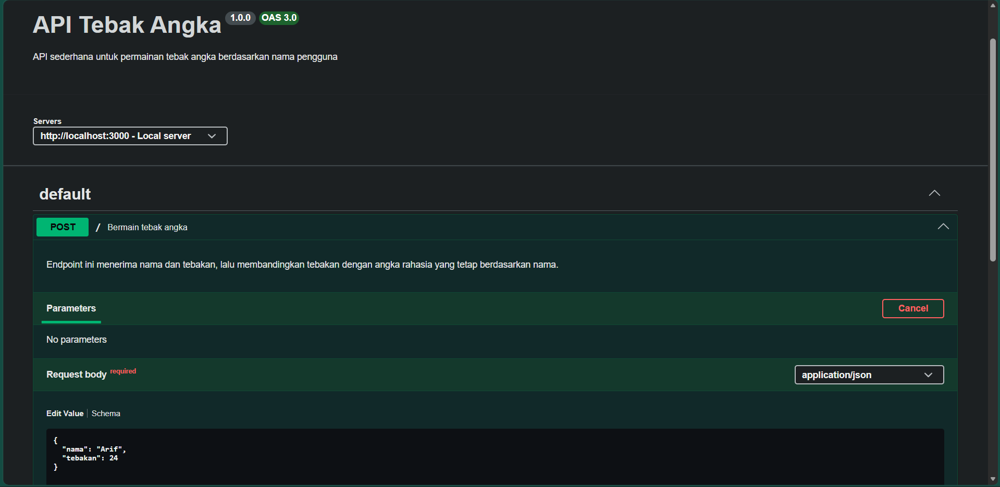
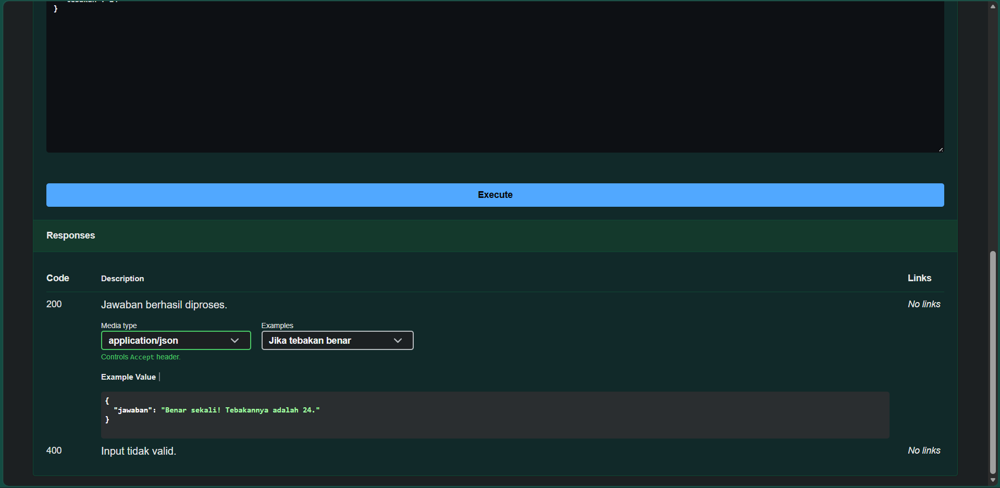

# Tugas Mandiri 09: API Design dan Construction Using Swagger
**Nama:** Arif Stand Pramudya

**NIM:** 103122400001

**Kelas:** S1SE-08-02

## Soal

Mari kita main tebak-tebakan angka acak!

Tugasmu adalah membuat API yang terdiri dari satu endpoint saja, yaitu POST /. Ketika kita melakkukan POST, formatnya adalah seperti di bawah ini.

```
{
  "nama": "Hamid",
  "tebakan": 24
}
```
Jika tebakan benar.

```
{
    "jawaban": "Benar sekali! Tebakannya adalah 24."
}
```

Jika tebakan terlalu tinggi.

```
{
    "jawaban": "Tebakanmu terlalu tinggi!"
}
```

Jika tebakan terlalu rendah.

```
{
    "jawaban": "Tebakanmu terlalu rendah!"
}
```

Beberapa aturan:

1. Angka acak yang dihasilkan harus tetap dan tidak boleh berubah setiap kali permintaan API dilakukan, tetapi boleh berubah setiap harinya atau dibuat tetap selamanya
2. Rentang harus di antara 1-100
3. Nama harus sensitif terhadap besar kecil huruf (mis. hamid dan Hamid akan menghasilkan angka acak yang berbeda)
4. Tidak menggunakan pustaka apapun, murni mengandalkan nama dan tebakan

Penjelasan untuk nomor 1: Jika namanya Hamid, ia akan diharapkan tetap pada nilai tebakan 24 mau kamu melakukan 100 kali permintaan. Tidak ada jawaban benar di sini (Hamid tidak harus 24, bebas mau dibuat acak seperti apa yang penting harus tetap).

## Kode sumber

Tersedia di [index.js](index.js) dan [swagger.js](swagger.js)

## Output

Jika tebakan benar.



Jika tebakan terlalu tinggi.



Jika tebakan terlalu rendah.



Dokumentasi:




## Deskripsi Program

Pada tugas mandiri Modul 9, saya membuat API permainan tebak angka menggunakan Express JS. API ini memiliki satu endpoint, yaitu `POST /`, yang menerima input berupa `nama` dan `tebakan`. Angka rahasia dibuat secara tetap berdasarkan nama pengguna, nama yang sama akan selalu menghasilkan angka yang sama, sedangkan nama dengan huruf besar dan kecil yang berbeda akan menghasilkan angka yang berbeda. API juga dilengkapi dokumentasi Swagger agar endpoint dapat diuji melalui halaman `/docs`.

Disini saya membuat fungsi `generateAngkaRahasia(nama)` untuk mengubah setiap huruf pada `nama` menjadi nilai angka menggunakan `charCodeAt()`, lalu nilai tersebut dihitung secara berulang dengan rumus `hash = hash * 31 + nilaiKarakter`. Hasil akhirnya dibuat tetap berada pada rentang 1 sampai 100 menggunakan `Math.abs(hash % 100) + 1`. Karena perhitungan berasal dari susunan huruf pada nama, nama yang sama akan selalu menghasilkan angka rahasia yang sama. Fungsi ini juga bersifat `case-sensitive`, sehingga nama seperti `Arif` dan `arif` dapat menghasilkan angka yang berbeda.