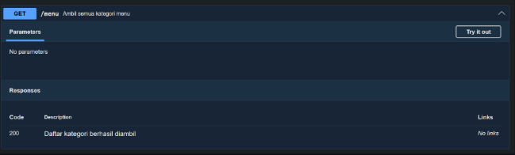
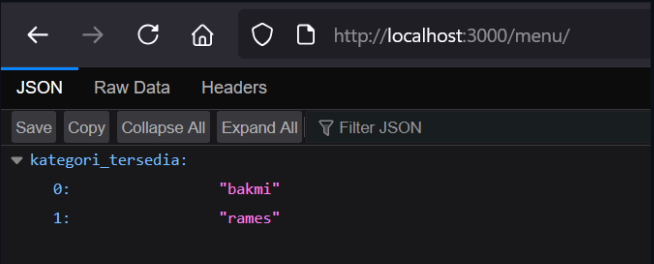
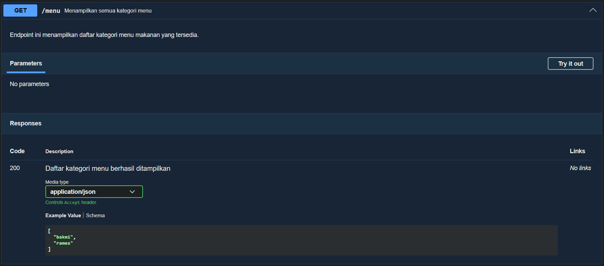
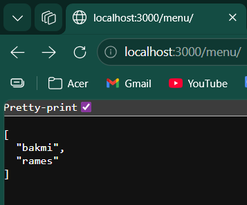

# Tugas Pendahuluan 09: API Design dan Construction Using Swagger
**Nama:** Arif Stand Pramudya

**NIM:** 103122400001

**Kelas:** S1SE-08-02

## Soal

Buatlah satu endpoint lagi beserta dokumentasi OpenAPI-nya, yaitu GET /menu yang menampilkan daftar semua nama kategori menu yang ada.

Dokumentasi:

Hasil `GET`:

## Kode sumber

Tersedia di [index.js](index.js) dan [swagger.js](swagger.js)

## Output

Dokumentasi:

Hasil `GET`:

## Deskripsi Program

Pada modul 9 tugas pendahuluan ini, saya membuat sebuah API sederhana menggunakan Express JS. API ini digunakan untuk menampilkan data menu makanan berdasarkan kategori. Selain itu, API juga didokumentasikan menggunakan Swagger atau OpenAPI agar endpoint lebih mudah dibaca, diuji, dan dipahami. Disini saya menambahkan endpoint `GET /menu` yang berfungsi untuk menampilkan seluruh kategori menu yang tersedia, yaitu bakmi dan rames.