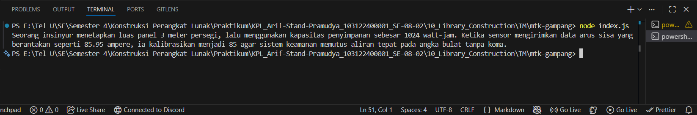

# Tugas Mandiri 10: Library Construction
**Nama:** Arif Stand Pramudya

**NIM:** 103122400001

**Kelas:** S1SE-08-02

## Soal

Buatkan pustaka yang rapi!

Pada tugas ini buatlah sebuah proyek baru bernama `mtk-gampang`. Struktur proyeknya wajib diatur seperti di bawah ini.

```
|   index.js
|   package.json
\---lib
        pangkat.js
        bulat.js
        kuadrat.js
```

Setiap berkas `lib` hanya memiliki satu fungsi saja.

1. `pangkat.js` berisi fungsi `pangkat(x, y)` yang mengembalikan nilai akhir dari x pangkat y.
2. `bulat.js` berisi fungsi `bulat(x)` yang mengubah bentuk bilangan non-bulat menjadi bulat (mis. `-4.25` menjadi `-4`) .
3. `kuadrat.js` berisi fungsi `kuadrat(x)` yang mengembalikan nilai akar kuadrat 2 dari `x`.

Satu batasannya adalah fungsi-fungsi ini harus diakses dari `index.js` (sebagai nilai dari properti `main`), bukan dari `lib` masing-masing.

Jika sudah selesai, buatlah proyek baru lagi dan instal pustaka yang kamu buat secara lokal. Pada `index.js`-nya, gunakan kode ini untuk memastikan bahwa kamu berhasil melakukannya.

```
import { kuadrat, pangkat, bulat } from "libr";

const narasi = `Seorang insinyur menetapkan luas panel ${bulat(kuadrat(12))} meter persegi, lalu menggunakan kapasitas penyimpanan sebesar ${pangkat(2, 10)} watt-jam. Ketika sensor mengirimkan data arus sisa yang berantakan seperti 85.95 ampere, ia kalibrasikan menjadi ${bulat(85.95)} agar sistem keamanan memutus aliran tepat pada angka bulat tanpa koma.`;

/**
 * Seorang insinyur menetapkan luas panel 3 meter persegi, lalu menggunakan kapasitas penyimpanan sebesar 1024 watt-jam. Ketika sensor mengirimkan data arus sisa yang berantakan seperti 85.95 ampere, ia kalibrasikan menjadi 85 agar sistem keamanan memutus aliran tepat pada angka bulat tanpa koma.
 * /

console.log(narasi);
```

## Kode sumber

Tersedia di [index.js](./mtk-gampang/index.js), [pangkat.js](./mtk-gampang/lib/pangkat.js), [bulat.js](./mtk-gampang/lib/bulat.js), dan [kuadrat.js](./mtk-gampang/lib/kuadrat.js)

## Output



## Deskripsi Program

Pada modul 10 tugas mandiri ini, saya membuat tiga library yang menyediakan fungsi matematika dasar, yaitu `pangkat(x, y)` untuk menghitung hasil dari x pangkat y menggunakan fungsi `Math.pow()`. Lalu, `bulat(x)` untuk membulatkan angka desimal x menjadi bilangan bulat terdekat ke bawah dengan `Math.floor()`. Yang terakhir, `kuadrat(x)` untuk menghitung akar kuadrat dari x menggunakan `Math.sqrt()`. Fungsi fungsi tersebut diimpor ke dalam file utama pada `index.js` untuk digunakan dalam contoh narasi perhitungan yang melibatkan operasi matematika dasar, seperti kuadrat, pangkat, dan pembulatan angka. Program ini memberikan solusi sederhana untuk memanipulasi dan menghitung nilai matematika.