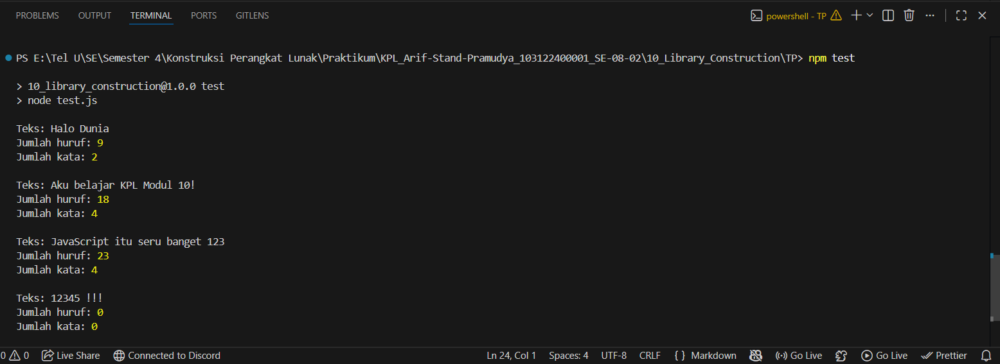

# Tugas Pendahuluan 10: Library Construction
**Nama:** Arif Stand Pramudya

**NIM:** 103122400001

**Kelas:** S1SE-08-02

## Soal

Buatlah pustaka JavaScript yang menyediakan utilitas berupa dua fungsi yang menghitung jumlah huruf dan jumlah kata.

Kriteria:

1. Hanya alfabet A hingga Z yang dihitung (besar dan kecil)
2. Spasi tidak dihitung
3. Pustaka bisa diimpor

## Kode sumber

Tersedia di [index.js](index.js) dan [test.js](test.js)

## Output

## Deskripsi Program

Pada modul 10 tugas pendahuluan ini, saya membuat Program pustaka JavaScript sederhana untuk menghitung jumlah huruf dan jumlah kata dalam sebuah teks. Program memiliki dua fungsi utama, yaitu `hitungHuruf()` dan `hitungKata()`. Fungsi `hitungHuruf()` digunakan untuk menghitung semua karakter alfabet dari A sampai Z, tanpa menghitung spasi, angka, dan tanda baca. Selanjutnya, fungsi `hitungKata()` digunakan untuk menghitung jumlah kata berdasarkan kumpulan huruf dalam teks. Program juga melakukan validasi input. Jika input bukan string, program akan menampilkan error agar data yang diproses tetap sesuai.