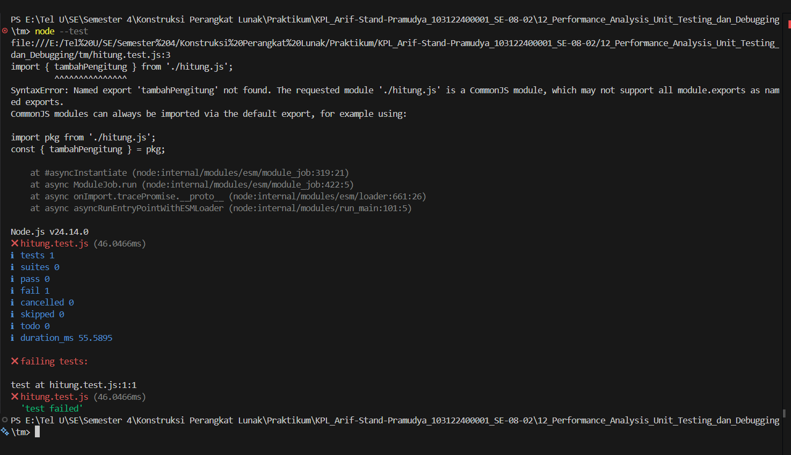
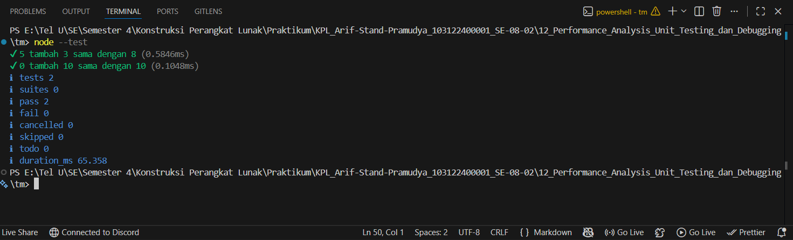

# Tugas Mandiri 12: Performance Analysis, Unit Testing, dan Debugging
**Nama:** Arif Stand Pramudya

**NIM:** 103122400001

**Kelas:** S1SE-08-02

## Soal

Fungsi di bawah ini melakukan penjumlahan pada penghitung (counter), yang sesederhana menambahkan jumlah jika kamu menekan tombol.

`hitung.js`

```
function tambahPengitung(terkini, jumlah) {
  terkini = terkini + jumlah;
  return terkini;
}
```
`hitung.test.js`

```
import { test } from 'node:test';
import assert from 'node:assert';
import { tambahPengitung } from './hitung.js';

test('5 tambah 3 sama dengan 8', () => {
  assert.strictEqual(tambahPengitung(5, 3), 8);
});

test('0 tambah 10 sama dengan 10', () => {
  assert.strictEqual(tambahPengitung(0, 10), 10);
});
```

Bisakah kamu tunjukkan apakah kode sudah benar atau bagian mana yang perlu diperbaiki beserta alasannya?

## Kode sumber

Tersedia di [hitung.js](hitung.js), [hitung.test.js](hitung.test.js) dan [package.json](package.json)

## Output

Sebelum Perbaikan:



Setelah Perbaikan:



## Deskripsi Program

Pada tugas mandiri di modul 12 ini, saya melakukan analisis dan perbaikan kode sederhana yang berkaitan dengan unit testing menggunakan `node:test` dan `assert`.

Setelah melakukan analisis kode secara keseluruhan, ditemukan satu bagian yang perlu diperbaiki pada file `hitung.js`, yaitu fungsi `tambahPengitung()` belum diekspor. Padahal pada file `hitung.test.js`, fungsi tersebut dipanggil menggunakan sintaks `import`. Oleh karena itu, solusi yang saya terapkan adalah menambahkan `export` pada fungsi `tambahPengitung()` agar fungsi dapat digunakan dan diuji pada file lain.

```
// Sebelum:
function tambahPengitung(terkini, jumlah) {
  terkini = terkini + jumlah;
  return terkini;
}
```

```
// Sesudah:
export function tambahPengitung(terkini, jumlah) {
  return terkini + jumlah;
}
```

Fungsi utama program ini adalah `tambahPengitung(terkini, jumlah)`, yang digunakan untuk menjumlahkan nilai awal dengan nilai tambahan, lalu mengembalikan hasil akhirnya. File `hitung.test.js` digunakan untuk menguji fungsi tersebut menggunakan `assert.strictEqual()`. Jika hasil fungsi sesuai dengan nilai yang diharapkan, maka pengujian dinyatakan berhasil.