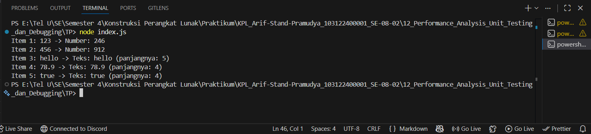

# Tugas Pendahuluan 12: Performance Analysis, Unit Testing, dan Debugging
**Nama:** Arif Stand Pramudya

**NIM:** 103122400001

**Kelas:** S1SE-08-02

## Soal

Cobalah untuk menangkap kecacatan dalam kode ini:

```
function main() {
  const data = [
    "123",
    456,
    "hello",
    78.9,
    true,
  ];

  for (let i = 0; i < data.length; i++) {
    const result = processData(data[i]);
    console.log(`Item ${i + 1}: ${data[i]} -> ${result}`);
  }
}

function processData(data) {
  const str = data.toLowerCase();
  const num = parseInt(str);
  if (!isNaN(num) && str === String(num)) {
    return `Number: ${num * 2}`;
  }
  return `Teks: ${str} (panjangnya: ${str.length})`;
}

main();
```

## Kode sumber

Tersedia di [index.js](index.js)

## Output



## Deskripsi Program

Pada tugas pendahuluan di modul 12 ini, saya melakukan analisis dan perbaikan kode pada soal yang berisi dua fungsi utama menggunakan teknik debugging. 

Setelah melakukan analisis kode secara keseluruhan, ditemukan satu bug pada fungsi processData(), tepatnya pada baris:

```
const str = data.toLowerCase();
```

Jadi, solusi yang saya terapkan adalah menambahkan konversi tipe menggunakan `String()` sebelum memanggil `.toLowerCase()`, sehingga semua tipe data terlebih dahulu diubah menjadi string.

```
// Sebelum:
const str = data.toLowerCase();

// Sesudah:
const str = String(data).toLowerCase();
```

Fungsi pertama adalah `main()` yang berfungsi sebagai program utama. Fungsi ini mendefinisikan array data yang berisi campuran tipe data ada `string`, `number`, dan `boolean`. Lalu melakukan iterasi pada setiap elemen dan mencetak hasil pemrosesan masing-masing elemen ke konsol. 

Fungsi kedua adalah `processData(data)` yang menerima sebuah nilai dengan tipe apapun, dan mengonversinya ke string, lalu menentukan apakah nilai tersebut merupakan bilangan bulat. Jika `ya`, fungsi mengembalikan nilai bilangan tersebut dikalikan dua. Jika `tidak`, fungsi mengembalikan teks beserta panjang karakternya.
