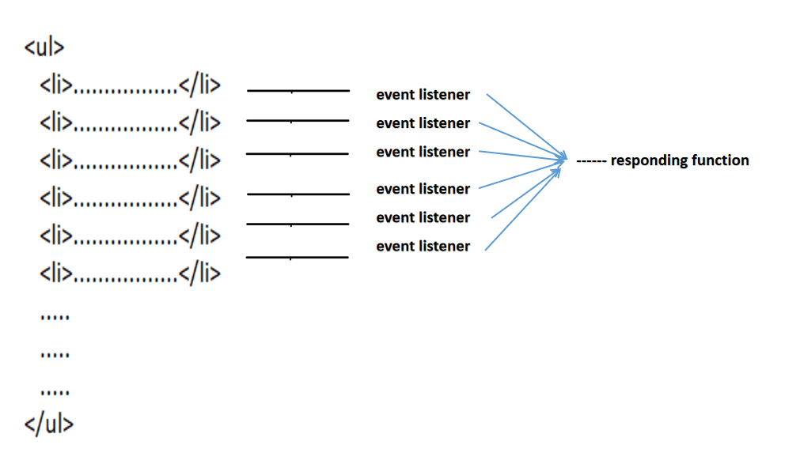

# Tugas Mandiri 13: Design Pattern Implementation
**Nama:** Arif Stand Pramudya

**NIM:** 103122400001

**Kelas:** S1SE-08-02

## Soal

Jelaskan dengan kemampuanmu apa itu event delegation dalam design pattern JavaScript. Tidak ada batas bobot kata dalam menjawab tugas ini, tetapi penilaian akan bergantung dari sepaham apa dan sebagus apa kamu menyajikan jawabanmu.

## Kode sumber

Source belajar: 

- https://www.geeksforgeeks.org/javascript/event-delegation-in-javascript/
- https://davidwalsh.name/event-delegate
- https://www.greatfrontend.com/questions/quiz/explain-event-delegation

## Output



## Deskripsi Program

Menurut saya, event delegation adalah teknik memasang satu event listener pada elemen parent, bukan memasang satu per satu pada elemen child. Jadi, teknik ini bekerja karena adanya event bubbling, yaitu perilaku ketika event yang terjadi pada elemen child akan naik ke elemen parent nya pada struktur DOM.

Contoh sederhananya:

```
<ul id="daftar">
  <li>Item 1</li>
  <li>Item 2</li>
  <li>Item 3</li>
</ul>
```

Daripada menulis event listener untuk setiap `<li>`, cukup untuk memasangnya di `<ul>`

```
document.getElementById("daftar").addEventListener("click", function (event) {
  if (event.target.tagName === "LI") {
    console.log("Yang diklik:", event.target.textContent);
  }
});
```

Saat user melakukan klik salah satu `<li>`, event sebenarnya terjadi di `<li>`. Namun karena event tersebut melakukan bubbling, event akan naik ke `<ul>`, lalu listener di `<ul>` bisa menangkapnya. Di dalam handler, memakai `event.target` untuk mengetahui elemen asli yang di klik.

Jadi kesimpulannya, adalah DOM event delegation adalah cara menangani banyak event pada elemen child melalui satu listener di elemen parent. Teknik ini memanfaatkan event bubbling sehingga dapat mempersingkat kode, lebih mudah untuk elemen yang dinamis, dan lebih efisien.