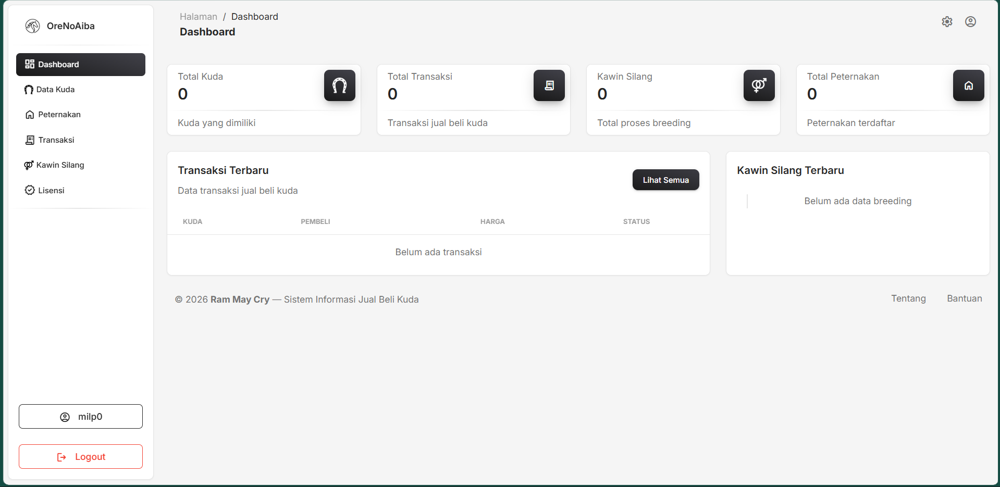

# Tugas Pendahuluan 13: Design Pattern Implementation
**Nama:** Arif Stand Pramudya

**NIM:** 103122400001

**Kelas:** S1SE-08-02

## Soal

Bukalah repostori kode tugas besarmu dan carilah satu saja design pattern yang digunakan di dalamnya (boleh design pattern apa saja, akan direviu kasus-per-kasus). Sertakan kodenya di tugas ini dan coba jelaskan desainnya.

## Kode sumber

Tersedia pada repository [https://github.com/vallreey/TUBES-Ram_May_Cry-BasDat_KPL-SE_08_02/tree/staging](https://github.com/vallreey/TUBES-Ram_May_Cry-BasDat_KPL-SE_08_02/tree/staging) 

File yang relevan:
- [app/Models/Kuda.php
](https://github.com/vallreey/TUBES-Ram_May_Cry-BasDat_KPL-SE_08_02/blob/staging/app/Models/Kuda.php)

- [app/Http/Controllers/KudaController.php
](https://github.com/vallreey/TUBES-Ram_May_Cry-BasDat_KPL-SE_08_02/blob/staging/app/Http/Controllers/KudaController.php)

- [resources/views/admin/kuda/index.blade.php
](https://github.com/vallreey/TUBES-Ram_May_Cry-BasDat_KPL-SE_08_02/blob/staging/resources/views/admin/kuda/index.blade.php)

- [routes/web.php](https://github.com/vallreey/TUBES-Ram_May_Cry-BasDat_KPL-SE_08_02/blob/staging/routes/web.php)

## Output

## Deskripsi Program

Pada project ini kelompok kami menggunakan design pattern `MVC`, disini kami memisahkan aplikasi menjadi tiga komponen utama yaitu, `Model`, `View`, dan `Controller`. Project kami adalah aplikasi manajemen peternakan kuda berbasis web yang dibangun menggunakan `Laravel` dan `PHP`. Aplikasi ini mengelola data kuda, peternakan, transaksi jual-beli, kawin silang, dan lisensi kuda.

Design pattern `MVC` diterapkan secara konsisten di seluruh project ini, seperti:

- `Model (app/Models/)` untuk merepresentasikan beberapa tabel di database seperti kuda, peternakan, transaksi, dll. Beserta relasi antar tabel menggunakan Eloquent ORM. Model tidak berisi logika tampilan maupun logika request.

- `View (resources/views/)` berisi file Blade template yang hanya bertanggung jawab merender data ke HTML. View menerima data dari Controller melalui fungsi compact() dan tidak melakukan query database secara langsung.

- `Controller (app/Http/Controllers/)` menjadi satu-satunya komponen yang mengandung logika bisnis, termasuk pengecekan role user seperti admin, peternak, dan pembeli untuk menentukan data mana yang boleh dilihat atau diubah. Controller memanggil Model untuk mengambil data, lalu meneruskan hasilnya ke `View`.

Manfaat penerapan MVC pada project ini adalah pemisahan tanggung jawab yang jelas apabila skema database berubah, hanya `Model` yang perlu diperbarui. Jika tampilan berubah, hanya `View` yang disentuh. Jika logika bisnis berubah, cukup modifikasi `Controller` dan komponen lain tidak terpengaruh.