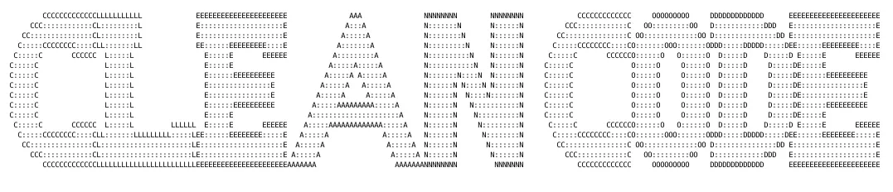

# Tugas Pendahuluan 14: Clean Code
**Nama:** Arif Stand Pramudya

**NIM:** 103122400001

**Kelas:** S1SE-08-02

## Soal

Kode ini tampak baik dan bagus, tetapi menyalahi beberapa prinsip kode bersih. Bisakah kamu melakukan refaktorisasi? Dimodifikasi dari [amrrwael/Delivery-website-Hits](https://github.com/amrrwael/Delivery-website-Hits).

Sebagai konteks, fungsi di bawah ini menampilkan rincian pesanan di modal dan jika klik konfirmasi, sistem apa menyimpannya.

```
function fetchOrderDetails(orderId, token) {
    fetch(`https://example.com/api/order/${orderId}`, {
        headers: {
            'Authorization': token
        }
    })
    .then(response => {
        if (!response.ok) {
            throw new Error('Failed to fetch order details');
        }
        return response.json();
    })
    .then(order => {
        // Display order info
        const modal = document.getElementById('orderModal');
        const detailsDiv = modal.querySelector('#orderDetails');
        detailsDiv.innerHTML = '';

        const header = document.createElement('h3');
        header.textContent = `Order ID: ${order.id}`;
        detailsDiv.appendChild(header);

        const status = document.createElement('p');
        status.textContent = `Status: ${order.status}`;
        detailsDiv.appendChild(status);

        // Show modal
        modal.style.display = 'block';

        // Setup close button
        const closeBtn = modal.querySelector('.close');
        closeBtn.addEventListener('click', () => {
            modal.style.display = 'none';
        });

        // Setup confirm button
        const confirmBtn = modal.querySelector('#confirmOrderBtn');
        if (order.status === 'Delivered') {
            confirmBtn.style.display = 'none';
        } else {
            confirmBtn.addEventListener('click', () => {
                confirmOrder(order.id, token);
            });
        }
    })
    .catch(error => {
        console.error('Error:', error);
    });
}
```

## Kode sumber

Tersedia di [tp14.js](tp14.js)

## Output



source: http://patorjk.com/software/taag/#p=display&f=Doh&t=CLEAN%20CODE

## Deskripsi Program

Pada tugas pendahuluan modul 14 ini, saya melakukan refaktorisasi pada kode `fetchOrderDetails()` karena fungsi tersebut masih menyalahi beberapa prinsip clean code, seperti terlalu banyak pekerjaan dalam satu fungsi seperti mengambil data order, menampilkan modal, membuat elemen HTML, mengatur tombol close, dan mengatur tombol confirm. 

Kode di [tp14.js](tp14.js) sudah saya lakukan refaktorisasi agar sesuai dengan prinsip clean code. Sekarang fungsi `fetchOrderDetails()` hanya bertugas mengatur alur utama, yaitu mengambil data pesanan dari API melalui fungsi `getOrderFromApi()` dan menampilkannya ke dalam modal melalui fungsi `renderOrderModal()`. Selanjutnya, proses pengisian detail pesanan dipisahkan ke fungsi `populateOrderDetails()`, sedangkan pengaturan tombol close dibuat dalam fungsi `setupCloseButton()` dan tombol confirm dibuat dalam fungsi `setupConfirmButton()`.

Dengan refaktorisasi ini kode menjadi lebih rapi, mudah dipahami, dan setiap fungsi nya memiliki tanggung jawab yang lebih jelas.